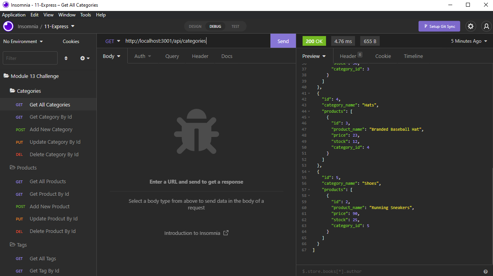

# Ecommerce Backend

## Table of Contents
1. [Description](#description)
2. [Demonstration](#video-demonstration)
3. [Usage](#usage)
4. [Resources](#resources)

## Description
An Express server example of an ecommerce backend with api routes.

## Usage
- Make sure you have [NodeJS](https://nodejs.org/en/download/) installed
- Clone the project to your machine
-  Navigate to the project folder in your terminal, using MySQL shell run
```bash
source db/schema.sql
```
- Exit MySQL shell, then run
```bash
npm run seed
npm start
```
- Make API requests using Insomnia or your tool of choice

## Video Demonstration
[](https://streamable.com/s2sbxd)

## Resources
- [Online Repository](https://github.com/JtheFox/ecommerce-backend)
